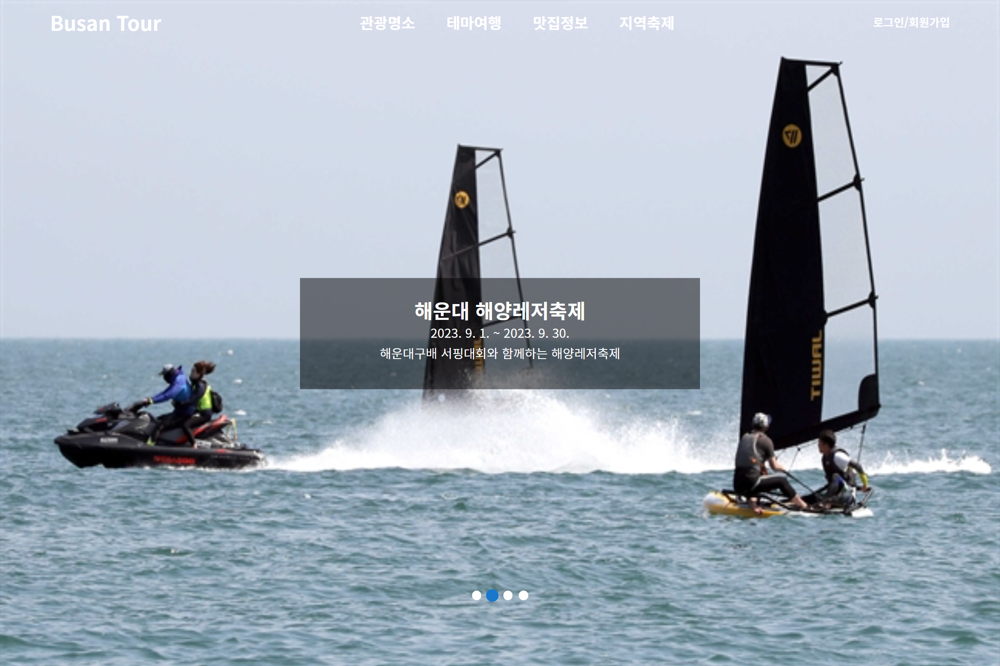
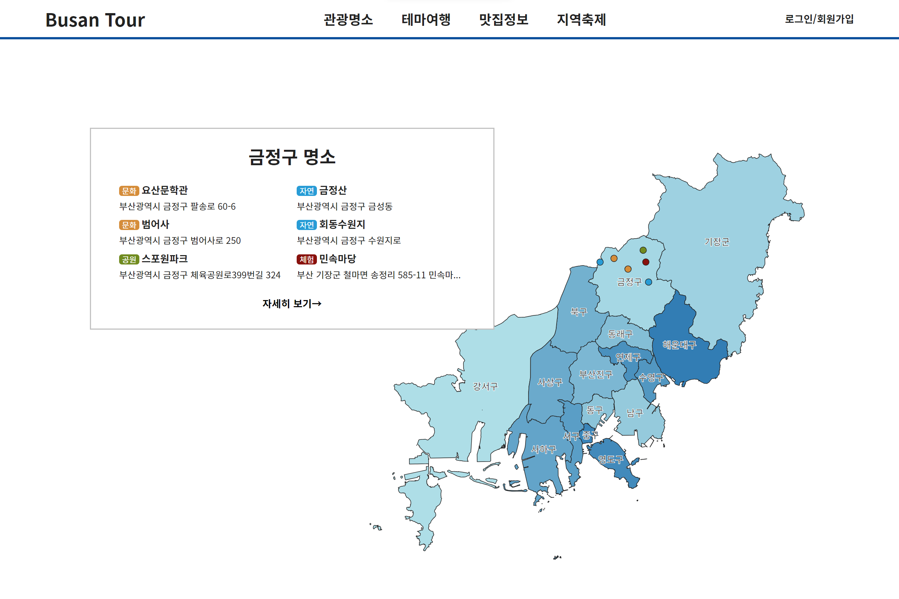
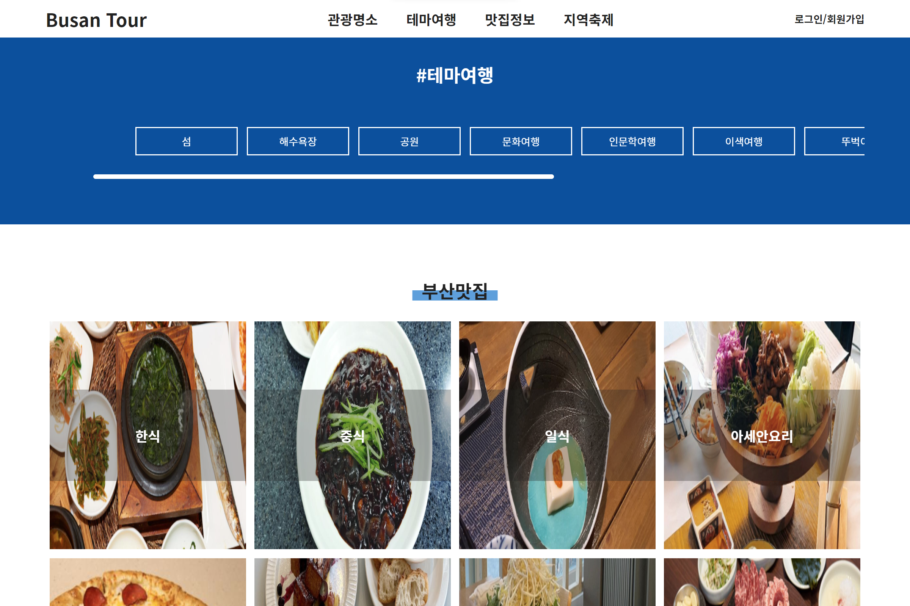
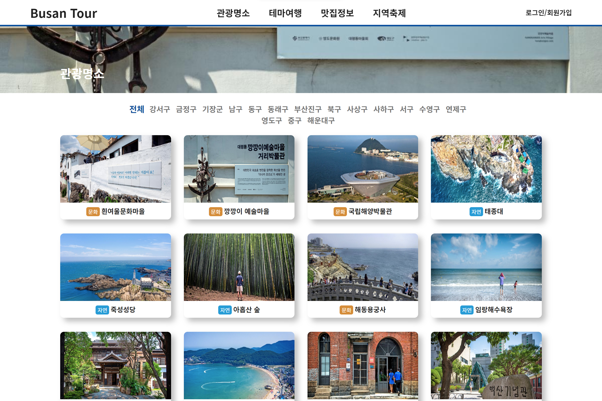
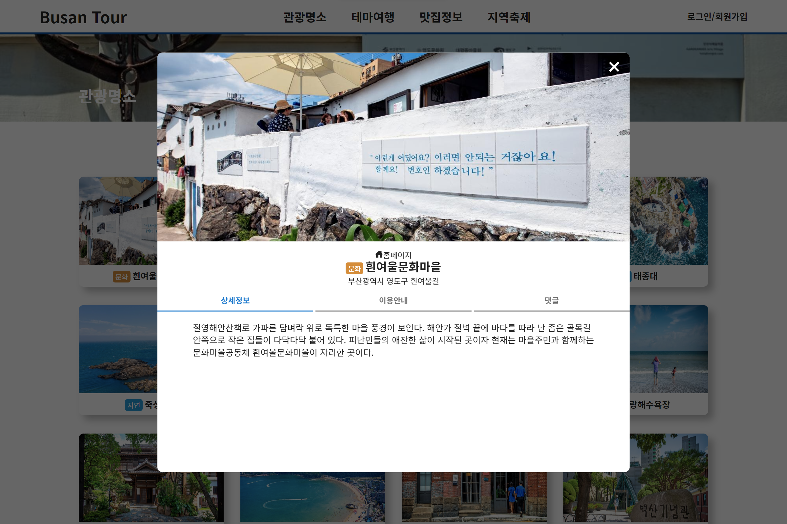
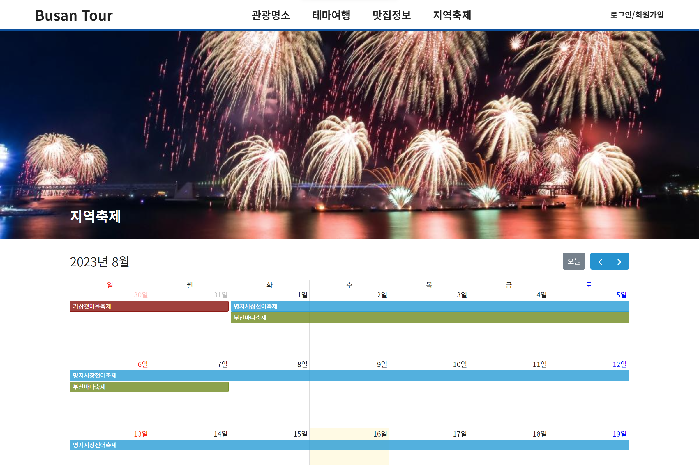

# 부산 관광 정보

<div>


</div>

> 부산광역시의 명소, 추천투어, 맛집, 축제 관련 정보를 소개하는 웹페이지

## 실행 방법

**백엔드(Backend): [icecaptin github](https://github.com/icecaptin/JAVA_SpringBoot/tree/main/BusanProject)**

```sh
npm start
```

## 기능 예시



**메인 페이지 축제 영역**

- 캐러셀 구현

---



**메인 페이지 명소 영역**

- QGIS로 명소 지도 생성

---



**메인 페이지 투어 영역**

- 가로 스크롤 구현

---



**관광명소, 테마여행, 맛집정보 상세 페이지**

- pagination 구현

---



**상세 페이지**

- 모달 구현

---



**축제 상세 페이지**

- fullcalendar 사용

## 부족한 부분

- styled-components 중복 최소화 필요
- React.memo, useCallback을 사용하여 컴포넌트 성능 최적화 필요
